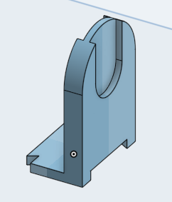

Hey there! This is my first project post of sorts, where I'll basically overview the design process of a project of mine, the various stages of its development, amongst other things.

## Version One

For the first version, I was largely inspired by various tape dispensers I saw on thingiverse, all of which were composed of two key components: A base with two upright walls, and a rod that can be placed onto the walls through a slot of some sort. 

Now I wanted mine to be easy to print and assemble, so I split it into a few more parts, namely seperating the walls from the bottom base, with two press fit joints connecting them. 

Through out the printing there were a few small issues, notable some bowing issues on the curve of the rod, and some warping of the long bed piece at the bottom, nothing too insane though.

Once assembled, there were a few other issues, notably the end caps not fitting too securely into the bed piece, the rod being a tighter fit than desired in the slots, and most importantly, all of my washi tapes not fitting onto it. Mostly because I didn't measure how long all of my washi tapes would be, but it also alerted me that this device would have to be able to grow easily in the future

## Version Two

With version two, I opted for a more modular version of version 1. Its made up of one right end cap piece, a variety of connector pieces in different sizes that attach together, and differently sized rods that ideally fit in between each connector piece. 

# One of the connector pieces

I printed it with mostly no issue, but when I went to assemble it is when things started heading a bit south.

The connections between the pieces were imperfect, which wasn't a huge issue between two individual pieces, but when added up over 10 different pieces, all with imperfections, it caused some kinda severe bowing. Luckily, I had an incredibly complex and involved solution to fix this temporarily.

Also known as tape.

Once the base was assembled and I started try to attach the washi tapes, I noticed a few more issues. For one, some of the tapes weren't fitting in the slots they were supposed to fit in, likely due to a mix of the bowing and tolerances not being high enough. Furthermore, some of the rods were either too large for their slots or too short for the space they were supposed to fit in. I suspect this is because of some warping during printing and again, too low of tolerances in spacing. 

## Version 3 - Final

With version 3 I took a slightly different approach. I did away with the press fit slots that caused me so much grief the previous tries, opting for small pegs and holes that would encourage correct alignment along one axis, requiring either tape or a rubber band to hold them together long term (More on that later). I also did away with the pegs, and instead gave each compartment a curved base that the washi tape could simply sit in until use.

Printing gave me few issues, except realizing that I should not print these pieces with a brim, as its difficult to remove from the little holes at the bottom, and in general, isn't worth the trouble.

Version 3 was the best version I could hope for at this point. I plan to wrap a rubber band around the whole assembly to hold it together horizontally. Along with that, the washi tapes can be a bit difficult to remove from their compartments, but not excessively so. Lastly, this only works for spools of washi tape under a certain diameter, in this case around 40mm. Regardless, it worked for my needs, and thus the project was complete.

## Conclusion

I've typed the word washi 17 times in this post, including in file names. 

I might further the project in the future, add more sizes, etc, but for now, it works for my needs. If you have the means and desire to print this yourself, by all means [download the files here](https://drive.google.com/drive/folders/1r0VZHcYLbZU1_W3jM30s6pNm5G8rwHh5?usp=sharing)! Thanks!